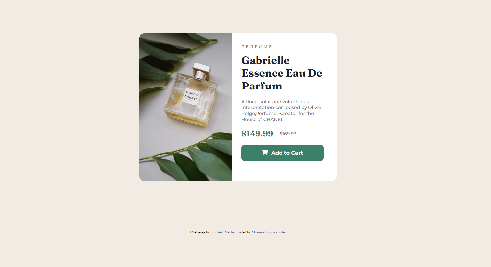
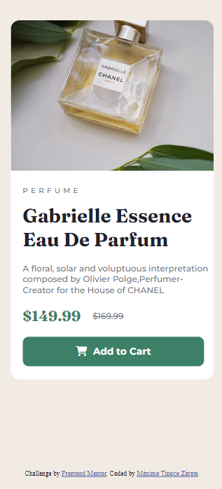

# Mentor frontend - Product preview card component fix

This is a solution to [Mentor Frontend Product Preview Card Component Challenge] (https://www.frontentmentor.io/challenges/product-preview-card-component-go7umttrfa). Mentor Frontend Challenges They help you improve your coding skills by creating realistic projects.


### The challenge

Users must be able to:

- See the optimal layout depending on the screen size of your device
- View Hover and Focus states for interactive elements


### Screenshot






### Links

- Solution URL: [Add solution URL here](https://your-solution-url.com)
- Live Site URL: [Add live site URL here](https://your-live-site-url.com)


### Built with

- Semantic HTML5 markup
- CSS custom properties
- Flexbox
- CSS Grid
- Mobile-first workflow


### What I learned

I learned to use the overflow-hidden style that helps me hide all the elements that go outside the box or container (div class = "container") and thus be able to make the border radius apply to the image as well.

To see how you can add code snippets, see below:

```HTML
<div class= "Container"> learning how to better use classes </div>
```
```CSS
.container {
    max-width: 600px; /* Maximum container size */
    width: 100%; /* Width of the container in percentage */
    margin: 150px auto; /* Center the container horizontally */
    background-color: white;
    border-radius: 15px;
    overflow: hidden; /* So that the rounded edge is applied to the image as well */
}
```

### Continuous development

I want to focus more on being able to expand my knowledge and thus improve my mobile designs while improving on other topics.

## Author

- Name - Maximo Tinoco Zarate
- Frontend Mentor - [@MaximoTz](https://www.frontendmentor.io/profile/MaximoTz)

